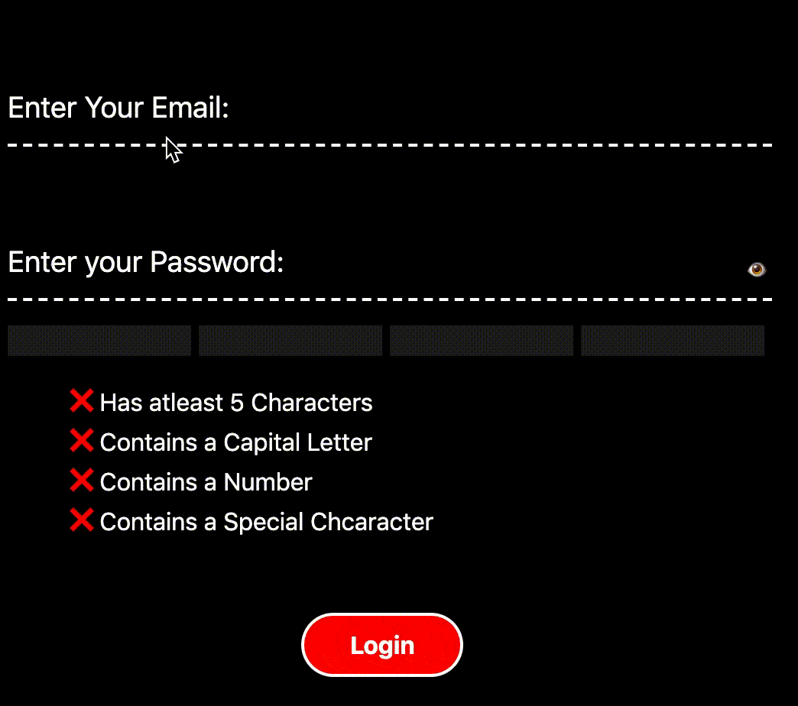

# Animated UI Components [ Ready to Use ]
Animate your components using CSS, Svelte and simple HTML

- [x] Animated Login Form using Svelte

- [ ] Animated Navbar

# To Contribute
🎉 First off, thanks for taking the time to contribute! 🎉
- Use [Issues](https://github.com/Keyurkariya/Animated-UI-Components/issues) tab to add feature requests or contributions that seems within the scope of this project.

- **Ensure the issue was not already reported.**

- **Make sure the issue is assigned to you before you start working on it.**

- Add comments in the code, and have meaningful commit messages.

## Demos
# 1. Animated Login Form

